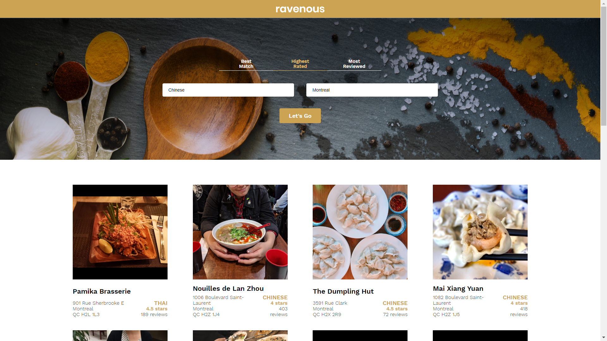

# Codecademy Building Front-end Applications with React

Created a React app to search for restaurants using the Yelp API.

A user can filter the restaurants by Best Match, Highest Rated and Most Reviewed.

The project tasks were divided in four parts:

## Part I
Creating Static Components

## Part II
Passing Information to Components

## Part III
Setting the State of Ravenous Components

## Part IV
Interacting with the Yelp API

